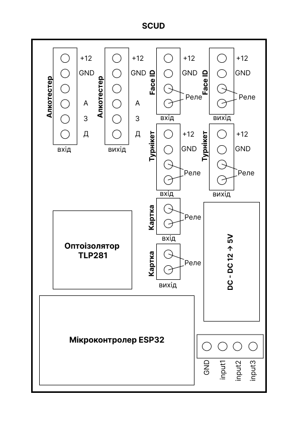
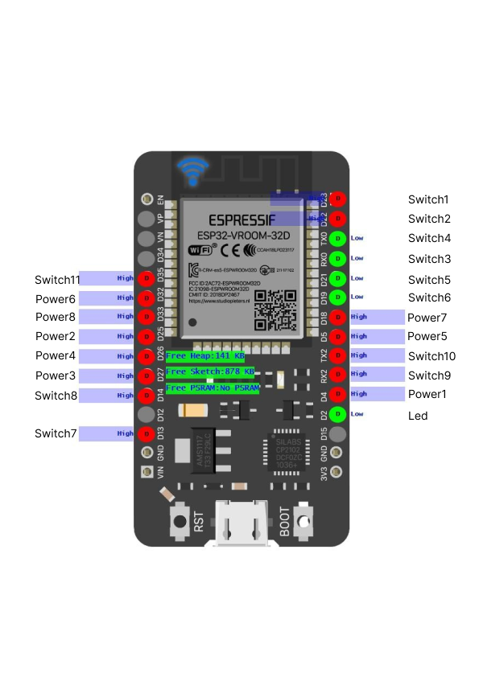

# SKUD
Прилад призначений для керування турнікетом у взаємодії з терміналом FaceId та алкотестером.

Контролер приймає сигнал від термінала FaceID, відправляє дані на сервер, де відбувається обробка подальшої логіки роботи, отримує відповідь і активує алкотестер або турнікет в залежності від даних, які прийшли.

У випадку втрати зв’язку з сервером контролер завжди активує алкотестер.

Перемикач (29) дозволяє обрати режим постійної активації алкотестера / режим обробки даних сервером.

Схеми в Figma - [посилання на проєкт](https://www.figma.com/design/Nd7bc0mb1TpfXyIu8w56VJ/SCUD?m=auto&t=jNlbcrbCwGCF1aqI-6)

Home page Tasmota
https://tasmota.github.io/

Web Installer
https://tasmota.github.io/install/

Release binaries for Tasmota firmware
http://sidweb.nl/tasmota32/release-14.1.0/

SetOption114 1		Отключить переключатели от реле 
SwitchTopic SKUD_SENSOR

SwitchMode1 1
SwitchMode2 1
SwitchMode3 1
SwitchMode4 1
SwitchMode5 1
SwitchMode6 1
SwitchMode7 1
SwitchMode8 1

Rule3
ON System#Boot DO backlog RuleTimer1 10; POWER5 0 ENDON ON Mqtt#Connected DO backlog POWER5 1; ENDON ON Rules#Timer=1 DO backlog Ping 185.65.247.248; RuleTimer1 10 ENDON ON Ping#185.65.247.248#Success==0 DO backlog POWER5 0 ENDON ON Mqtt#Disconnected DO backlog POWER5 0 ENDON

Rule3 1

Template:
{"NAME":"SKUD","GPIO":[1,163,224,162,225,259,1,1,1,166,167,1,1,258,260,165,0,164,161,160,0,1,1,1,0,0,0,0,1,1,1,1,1,0,0,1],"FLAG":0,"BASE":1}

