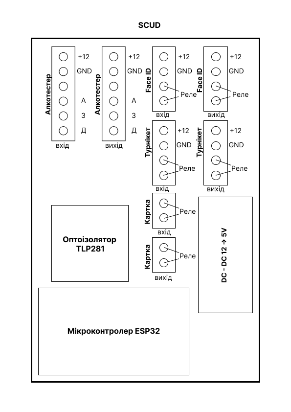

# SKUD
Прилад призначений для керування турнікетом у взаємодії з терміналом FaceId та алкотестером.

Контролер приймає сигнал від термінала FaceID, відправляє дані на сервер, де відбувається обробка подальшої логіки роботи, отримує відповідь і активує алкотестер або турнікет в залежності від даних, які прийшли.

У випадку втрати зв’язку з сервером контролер завжди активує алкотестер.

Перемикач (29) дозволяє обрати режим постійної активації алкотестера / режим обробки даних сервером.

Схеми в Figma - [посилання на проєкт](https://www.figma.com/design/Nd7bc0mb1TpfXyIu8w56VJ/SCUD?m=auto&t=jNlbcrbCwGCF1aqI-6)

